# Architecture (first sketch, §5.2)

A starting point for the team's own diagram. It matches the code as committed; redraw it in your own
style and keep it in sync with the code. In Q&A the diagram is compared with the code.

```mermaid
flowchart TD
    U[Tenant uploads lease<br/>PDF or DOCX] --> P

    subgraph CODE1 [Plain code: leasecheck/parsing.py]
      P[Extract text] --> S{Scanned PDF?<br/>Empty? Not a lease?}
      S -- yes --> R[Rejection message shown<br/>no model call made]
      S -- no --> C[Split into numbered clauses]
    end

    C --> E
    subgraph RAG [Capability 3: retrieval, leasecheck/retrieval.py]
      SRC[(sources/*.md<br/>c.186 §15B, 940 CMR 3.17, AG guide)] --> IDX[Embed chunks once<br/>cached in sources/index.npz]
      E[Embed every clause<br/>one request] --> SIM[Cosine similarity<br/>top 3 passages per clause]
      IDX --> SIM
    end

    SIM --> B
    subgraph LLM1 [Capabilities 1 + 4: leasecheck/analyzer.py + prompts.py + schemas.py]
      B[Batch of up to 15 clauses + their passages<br/>versioned prompt v1 / v2] --> G[Gemini, JSON mode<br/>BatchFindings schema]
      G --> J{Parses?}
      J -- no --> RETRY[Retry once] --> J2{Parses?}
      J2 -- no --> NC[Clauses marked 'could not be checked']
      J -- yes --> V[Drop source IDs the model invented]
      J2 -- yes --> V
    end

    C --> M
    subgraph TOOL [Capability 2: tool calling, leasecheck/charges.py]
      M[Clauses that mention money] --> G2[Gemini decides whether to call<br/>check_move_in_charges]
      G2 -- calls --> F[Python function applies<br/>c.186 §15B&#40;1&#41;&#40;b&#41; limits]
      F --> G3[Result returned to Gemini<br/>which summarises it]
      G2 -- no amounts --> NONE[No charges found]
    end

    V --> UI
    NC --> UI
    G3 --> UI
    NONE --> UI
    UI[Streamlit results: counts, move-in table,<br/>clause cards with citations, disclaimer] --> CHAT[Follow-up chat<br/>findings + retrieved passages, st.session_state memory]

    APIERR[[Any API error after retries]] -.-> MSG[Friendly error message;<br/>session cap counted]
```

Where each capability fires:

| Capability | File and function |
| --- | --- |
| 1. Structured prompting | `leasecheck/prompts.py`: `PROMPTS["v1"]`, `PROMPTS["v2"]`, `ACTIVE_VERSION` |
| 2. Tool calling | `leasecheck/llm.py: GeminiLLM.run_with_tools` calls `leasecheck/charges.py: check_move_in_charges` |
| 3. Retrieval | `leasecheck/retrieval.py: SourceIndex.search_many`, used in `analyzer.analyze` and the chat in `app.py` |
| 4. Structured output | `leasecheck/schemas.py: BatchFindings`, `parse_batch`; failure path in `analyzer._classify_with_retry` |
